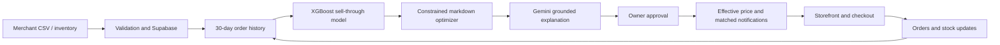

# FreshSaver AI

> Demand-aware markdowns for independent grocery stores.

FreshSaver predicts which perishable products are likely to remain unsold, tests multiple markdown levels, recommends the best risk-adjusted price, and alerts shoppers who opted into the relevant category. Stores protect more margin while reducing avoidable food waste.

Built for the **AI Builders Hackathon 2026**.

## Submission Links

- Public judge demo: `https://freshsaver-ai.vercel.app/demo`
- Live application: `https://freshsaver-ai.vercel.app`
- Demo video: add video URL
- Presentation deck: [`FreshSaver-AI-Builders-Hackathon.pptx`](docs/deck/FreshSaver-AI-Builders-Hackathon.pptx)
- Demand model API: `https://freshsaver-demand-model.onrender.com`
- Source repository: `https://github.com/Utpal-Kalita/FreshSaver-AI`

The `/demo` route is credential-free and uses clearly labeled synthetic data. It works without Supabase, Brevo, or any model API key.

## Problem

Expiry markdown decisions are still manual in many neighborhood stores:

- Discount too early and the store gives away margin.
- Discount too late and usable food becomes waste.
- Blanket discounts treat fast-moving and slow-moving stock identically.
- Staff cannot continuously compare stock, sales velocity, expiry risk, and customer demand.
- Broad promotions create notification fatigue and weak attribution.

Independent grocers need decision intelligence that works with their existing inventory exports, not expensive hardware or a multi-month enterprise integration.

## Solution

FreshSaver provides an end-to-end prevention workflow:

1. A merchant imports inventory from CSV.
2. The demand model reads completed store orders and estimates daily sales velocity, weekday effects, sample sufficiency, and validation error.
3. The markdown engine evaluates candidate prices against expected revenue and unsold-stock risk.
4. The dashboard shows the selected price, alternatives, confidence, inputs, and explanation.
5. The merchant retains control through manual overrides and scan exclusions.
6. Customers opted into matching categories receive a deal notification.
7. Checkout revalidates price and stock against the database before creating an order.
8. Scan, price, email, and order events remain auditable.

## Why This Is Different

Surplus marketplaces help list food after a merchant has decided it is surplus. FreshSaver acts earlier: it forecasts likely surplus, chooses a price intervention, applies policy guardrails, and measures the resulting workflow.

| Approach | Pricing | Workflow | FreshSaver difference |
|---|---|---|---|
| Manual labels | Staff judgment | Repeated shelf checks | Ranked, explainable decisions |
| Blanket markdown | Same percentage for a tier | Easy but margin-destructive | Product-level demand and stock signals |
| Surplus marketplace | Merchant selects a deal | Lists existing surplus | Predicts surplus before it becomes waste |
| Enterprise pricing | Advanced but costly | Long integration | CSV-first path for independent stores |

## Implemented Features

### Merchant Experience

- Secure Supabase authentication and store-admin scoping
- CSV upload, validation, database upsert, and source-file audit storage
- Inventory dashboard with stock, expiry, pricing, urgency, model source, and explanation
- Manual and scheduled scans with streamed progress
- Demand-aware markdown recommendation and price application
- Per-product candidate price evidence and recommendation audit trail
- Manual price override and scan exclusion compatibility
- Store-scoped scan, email, order, and product access
- Scan history and model evidence pages
- Order management and stock decrement

### Shopper Experience

- Browse stores and active deals
- Search and filter by category or urgency
- Product detail, store context, and live stock
- Single-store cart and server-validated checkout
- Account order history
- Store-specific category opt-ins from the website or an in-store QR journey
- Brevo promotional and transactional email workflow

### Judge Demo

- Works with no credentials at `/demo`
- Uses the same production recommender module
- Shows healthy and at-risk products
- Exposes all tested prices and the winning score
- Demonstrates approval, preference-based matching, and redemption
- Separates forecast rescue potential from campaign sales
- Labels all demo data as synthetic

## AI And Optimization

FreshSaver uses a hybrid AI architecture. An XGBoost service predicts sell-through
for every eligible markdown, a deterministic optimizer enforces price and safety
constraints, and Gemini turns the stored evidence into a grounded manager summary
and shopper campaign. Gemini never invents or changes the selected price.

### Demand Forecast

`ml-service/` trains and serves the primary demand model. It uses product, category,
stock, expiry horizon, candidate price, recent velocity, prior velocity, weekday,
and observation density to predict:

- Low, expected, and high units sold before expiry
- Probability of clearing available stock
- Per-candidate feature contributions from XGBoost

`lib/demand-forecast.ts` remains a transparent fallback when the model service is
unavailable. It builds a 30-day daily series from accepted and completed orders and calculates:

- Weighted recent sales velocity
- Day-of-week demand factor
- Number of observed sales
- Holdout mean absolute error over the latest seven days
- Model mode: `store_history` or `category_prior`

When the model service is unavailable or history is insufficient, the application
labels and records the deterministic fallback rather than presenting it as ML.

### Markdown Recommender

`lib/markdown-recommender.ts` evaluates candidate discounts according to expiry urgency. For each candidate it estimates:

```text
baseline demand = daily velocity * weekday factor * days remaining
discounted demand = baseline demand * (1 + category elasticity * discount)
expected revenue = expected units sold * discounted price
expected waste = stock - expected units sold
expected contribution = revenue - cost of goods - expected disposal cost
```

The engine selects the highest-scoring eligible candidate, enforces a merchant price
floor, preserves manual overrides, blocks expired products, and holds full price
when predicted demand is sufficient. Recommendations remain pending until a store
owner approves or rejects them.

Gemini receives only the selected recommendation and numerical evidence. It returns
structured manager rationale and campaign copy. Provider, model version, training
data provenance, predictions, factors, and generated content are retained in the
recommendation audit record. Synthetic model outcomes are not represented as live
business impact. See `docs/model-card.md`.

## Safety And Trust

- Expired products are blocked from automated sale.
- FreshSaver never changes or extends a recorded expiry date.
- Checkout revalidates active status, expiry status, price, and stock server-side.
- Manager overrides take precedence over automated prices.
- AI recommendations require owner approval before price publication or email delivery.
- Recommendation evidence records model mode, inputs, candidates, confidence, and version.
- Customer emails require an active subscription and matching category preference.
- Demo metrics are labeled synthetic and campaign sales are not claimed as incremental revenue.
- Stores remain responsible for storage, handling, recalls, labeling, and local food law.

## Architecture



### Stack

- Next.js 16 App Router and React 19
- TypeScript and Tailwind CSS 4
- Supabase PostgreSQL, Auth, Storage, and RLS
- Python, FastAPI, and XGBoost demand-model service
- Gemini structured output for grounded explanations and campaign copy
- Brevo transactional email
- Vercel hosting, serverless routes, and scheduled scans
- Vitest unit tests

Detailed diagrams and trust boundaries are in `docs/architecture.md` and `docs/security.md`.

## Repository Structure

```text
app/
  (customer)/              Customer marketplace and checkout
  dashboard/               Merchant inventory, scans, email, orders
  admin/                   Platform and store administration
  api/                     Products, scans, stores, orders, email
  demo/                    Credential-free judge workflow
components/                Shared merchant and customer UI
lib/
  demand-forecast.ts       Historical demand features and backtest
  ml-demand-client.ts      XGBoost service contract and validation
  markdown-recommender.ts  Candidate simulation and decision logic
  gemini-merchandising.ts  Grounded explanation and campaign generation
  scan-engine.ts           Scan orchestration and persistence
  csv-parser.ts            Strict CSV validation
  email.ts                 Preference-matched Brevo delivery
supabase/migrations/       Database schema, RLS, and atomic helpers
ml-service/                Training, evaluation, explainability, and inference API
```

## Quick Start

### Credential-Free Demo

Requirements: Node.js 20.19 or newer.

```bash
npm ci
npm run dev
```

Open `http://localhost:3000/demo`. The public landing page and synthetic demo both
work without connected services.

### Full Application

1. Copy `.env.example` to `.env.local` and add Supabase credentials.
2. Apply migrations `001` through `008` in order.
3. Train and deploy `ml-service/`, then set `DEMAND_MODEL_URL` and `DEMAND_MODEL_API_KEY`.
4. Configure `GEMINI_API_KEY` for grounded AI explanations and campaign copy.
5. Configure Brevo variables if real email delivery is required.
6. Run `npm run dev`.

For a new project, create or refresh the demo store, demo Auth users, store
assignment, shopper subscription, and sample inventory with:

```bash
node --env-file=.env.local scripts/bootstrap-supabase.mjs
```

The bootstrap is idempotent and does not print passwords or provider keys.

### One-Click Demo Accounts

Create separate store-owner and customer users in Supabase Auth, assign the owner
to a store in `store_admins`, and configure these server-only variables:

```bash
DEMO_STORE_OWNER_EMAIL=demo-owner@example.com
DEMO_STORE_OWNER_PASSWORD=replace-with-a-strong-demo-password
DEMO_CUSTOMER_EMAIL=demo-customer@example.com
DEMO_CUSTOMER_PASSWORD=replace-with-a-strong-demo-password
```

The login pages then expose one-click judge access without sending either password
to browser code. Use synthetic data only and reset the accounts before each demo.

Never expose `SUPABASE_SERVICE_ROLE_KEY` to browser code or commit it. A service-role credential was previously present in repository history and must be revoked before deployment. See `docs/security.md`.

## CSV Format

Required headers:

```csv
product_name,sku,price,mrp,expiry_date,category,image_url,stock_quantity,unit_cost,minimum_price,disposal_cost_per_unit
Organic Whole Milk,DAIR-104,84,95,2026-09-18,Dairy,,18,45,55,2
```

Validation includes:

- Required column checks
- Positive price and MRP
- MRP greater than or equal to price
- Real `YYYY-MM-DD` calendar dates
- Non-negative integer stock
- Duplicate SKU detection within a file
- 10,000-row and 5 MB upload limits

Use `sample_inventory.csv` or download `public/sample-products.csv`.

## Quality Checks

```bash
npm run lint
npm run typecheck
npm run test
npm run build
```

The tests cover strict dates, CSV validation, historical-demand fallback, model evidence, expiry blocking, healthy-stock price holds, candidate evaluation, and manager overrides.

## Business Model

FreshSaver is designed to charge 10% of attributable campaign sales, with no setup fee. A campaign-linked order can establish attribution, but it does not by itself prove that the sale was incremental. Production impact measurement should use merchant-approved baselines or controlled holdouts before claiming recovered revenue.

## Hackathon Submission Assets

- `docs/demo-script.md`: timed demo narrative under five minutes
- `docs/presentation.md`: ten-slide deck content
- `docs/model-card.md`: model behavior, data, evaluation, and limitations
- `docs/architecture.md`: system diagrams and production evolution
- `docs/judging-checklist.md`: requirement and acceptance checklist
- `docs/security.md`: secret rotation and trust boundaries

## Roadmap

- Store-specific elasticity learned from intervention outcomes
- Weather, holiday, time-of-day, and local-event demand features
- Controlled holdouts for incremental revenue and waste measurement
- Automatic second markdown when an offer underperforms
- POS integrations and electronic shelf labels
- Donations routing when safe sale is no longer likely
- Multi-location inventory transfers
- Allergen-aware matching based on verified catalog data

## License

MIT License. See `LICENSE`.
