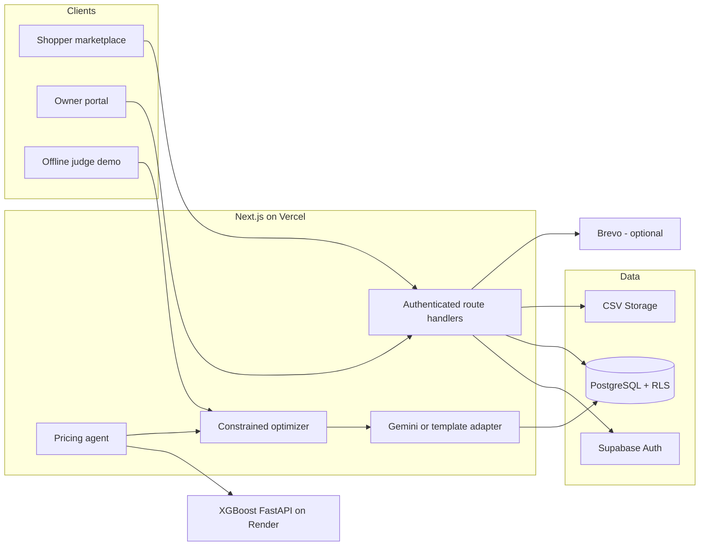

# FreshSaver AI

> Explainable, demand-aware markdown decisions for independent grocery stores.

FreshSaver predicts how much perishable inventory is likely to sell before expiry,
evaluates bounded markdown candidates, recommends a margin-aware price, requires
store-owner approval, and publishes the approved deal to opted-in shoppers.

Built for the **AI Builders Hackathon 2026**.

## Live Project

| Resource | Link |
|---|---|
| Live application | [freshsaver-ai.vercel.app](https://freshsaver-ai.vercel.app) |
| Credential-free judge demo | [freshsaver-ai.vercel.app/demo](https://freshsaver-ai.vercel.app/demo) |
| XGBoost model API | [freshsaver-demand-model.onrender.com](https://freshsaver-demand-model.onrender.com) |
| Public source | [github.com/Utpal-Kalita/FreshSaver-AI](https://github.com/Utpal-Kalita/FreshSaver-AI) |
| Presentation deck | [FreshSaver-AI-Builders-Hackathon.pptx](docs/deck/FreshSaver-AI-Builders-Hackathon.pptx) |
| 5-minute video script | [FreshSaver-5-Minute-Demo-Video-Script.pdf](docs/video/FreshSaver-5-Minute-Demo-Video-Script.pdf) |
| Demo video | Add submission video URL |

The `/demo` route is synthetic, credential-free, and independent of Supabase,
Render, Gemini, and Brevo. It is the safest primary link for judges.

## Contents

- [Problem](#problem)
- [How FreshSaver Works](#how-freshsaver-works)
- [Feature Inventory](#feature-inventory)
- [AI System](#ai-system)
- [Architecture](#architecture)
- [Local Setup](#local-setup)
- [Supabase Setup](#supabase-setup)
- [Demand Model Setup](#demand-model-setup)
- [Optional Gemini And Brevo Setup](#optional-gemini-and-brevo-setup)
- [Deployment](#deployment)
- [Routes](#routes)
- [Testing](#testing)
- [Known Limitations](#known-limitations)

## Problem

Near-expiry pricing is often managed with periodic shelf checks and blanket rules:

- Discount too early and the store gives away margin.
- Discount too late and usable food becomes waste.
- Products with the same expiry window can have very different demand.
- Small stores cannot continuously compare stock, recent sales, expiry, pricing,
  and customer interest.
- Broad promotions create notification fatigue and weak attribution.

Surplus marketplaces begin after a merchant has already declared food surplus.
FreshSaver acts earlier, while a price intervention can still change the outcome.

## How FreshSaver Works

```text
Inventory CSV or manual product entry
                |
                v
30-day accepted/completed order history
                |
                v
XGBoost sell-through prediction for every candidate price
                |
                v
Constrained contribution-margin optimizer
                |
                v
Grounded explanation and campaign copy
                |
                v
Pending recommendation -> owner approve/reject
                |
                v
Approved deal -> opted-in shoppers -> order/pickup outcome
```

The model predicts what may happen. Deterministic policy decides which actions are
allowed. The store owner decides whether the recommendation goes live.

## Feature Inventory

### Public Landing And Judge Experience

- Mission-led responsive landing page
- Clear shopper and store-owner entry points
- Live deal and partner-store previews when Supabase is configured
- Credential-free `/demo` with synthetic data
- Offline fallback recommender using the production policy module
- Candidate-price comparison bars
- Hold-price and markdown examples
- Synthetic shopper matching and redemption simulation
- Persistent synthetic-data and non-causal-impact labels
- Links to the connected owner demo

### Shopper Marketplace

- Public home, deals, stores, store-detail, and product-detail pages
- Search by product name
- Category, urgency-tier, and store filters
- Active deal cards with original price, current price, and discount
- Store directory and OpenStreetMap/Leaflet map
- Store-specific product pages and stock visibility
- Single-store cart enforcement
- Server-validated order prices and availability
- Explicit mock checkout with no real card processing
- Customer signup and login
- Customer account and order history
- Desktop navigation and mobile bottom navigation

### Store-Specific Shopper Opt-In

- `Notify me about deals` action on store profiles
- Website and in-store QR consent-source tracking
- Store-specific subscriptions rather than a global marketing list
- Category-interest matching
- Notification pause state
- Owner customer table with name, email, phone, location, interests, source, joined
  date, and status
- Email deduplication by customer, product, and tier
- Retry support for failed sends
- Locally personalized subjects and store/category context without sending customer PII to Gemini
- Product-specific recipe ideas with ingredients, steps, and food-handling disclaimers

### Store-Owner Portal

The primary owner navigation contains exactly four pages:

| Page | Capabilities |
|---|---|
| Dashboard | Product, expiry, active-deal, and subscriber metrics; upcoming expiry queue; last agent status; quick actions |
| Products | Store-scoped product table, stock, SKU, category, expiry, original/current price, discount, days-left status, manual add, CSV import |
| Customers | Store-specific opted-in customer database, category interests, consent source, notification status, in-store opt-in link |
| Pricing Log | Upcoming expiry queue, `Run Agent Now`, streamed stages, pending AI recommendations, approve/reject actions, previous run audit |

Additional owner workflows remain available for:

- CSV upload results and row-level validation errors
- Recommendation and scan detail evidence
- Email delivery logs
- Store-scoped order listing
- Order status transitions in the secondary fulfillment view

### Inventory Management

- Manual single-product creation
- CSV batch import
- Maximum 5 MB upload size
- Maximum 10,000 data rows
- Case-normalized headers
- Required-field validation
- Real `YYYY-MM-DD` date validation
- Positive price and MRP validation
- MRP must be greater than or equal to price
- Non-negative integer stock validation
- Duplicate SKU detection within a file
- Per-store SKU uniqueness
- Optional unit cost, price floor, and disposal cost
- Best-effort private source-file archive in Supabase Storage
- Store-scoped CSV audit log

### Pricing Agent

- Manual owner-triggered runs
- Vercel Cron schedule every two days at 06:00 UTC
- Server-sent progress events
- Progress stages for product loading, forecasting, pricing, and campaign creation
- Store-scoped scan lock and audit record
- Accepted/completed order-history input only
- Candidate markdowns bounded by expiry tier
- Full-price hold when predicted demand is sufficient
- Recorded-expiry sale block
- Manual price override preservation in the decision policy
- Stored candidate evidence, model version, source, metrics, and reason codes
- Pending recommendation creation without silently publishing a markdown
- Owner approval or rejection
- Price history entry after approval
- Inventory outcome event after approval
- Customer notification only after approval

### Platform Administration

- Platform KPI dashboard
- Store creation and management
- Store activation/deactivation
- Store-admin assignment and removal
- Per-store inventory and urgency analytics
- Recent scan and order visibility

The current super-admin implementation uses a code-defined email and should be
replaced with immutable role claims or a dedicated role table before production.

### Orders And Fulfillment

- Customer-specific order history
- Store-specific order access
- Server-side product, stock, active-state, expiry-state, and price revalidation
- Database price used instead of browser price
- Conditional stock decrement helper
- Constrained order status transitions
- Mock payment reference for demonstration

## AI System

FreshSaver uses a hybrid AI design instead of asking an LLM to invent a discount.

### 1. XGBoost Sell-Through Model

The FastAPI service in `ml-service/` predicts units sold before expiry for every
candidate markdown using:

- Product category
- Current stock
- Days until expiry
- Original and candidate price
- Candidate discount
- Recent seven-day velocity
- Previous 23-day velocity
- Weekday
- Number of historical observations

For each candidate it returns:

- Low, expected, and high units sold
- Probability of clearing available stock
- Per-feature XGBoost contributions
- Model version and training-data provenance

The deployed endpoint is authenticated with `DEMAND_MODEL_API_KEY`.

### 2. Constrained Price Optimizer

The TypeScript optimizer in `lib/markdown-recommender.ts` calculates:

```text
expected revenue = predicted units sold * candidate price
expected waste = stock - predicted units sold
expected contribution = revenue - cost of goods - expected disposal cost
```

The optimizer enforces:

- Recorded expiry block
- Merchant minimum price
- Maximum discounts by urgency tier
- Manager override precedence
- Available stock cap
- Full-price hold when demand can clear stock

If unit economics are unavailable, FreshSaver falls back to a revenue-minus-waste
risk score and labels that behavior.

### 3. Gemini Merchandising Adapter

When `GEMINI_API_KEY` is valid, Gemini receives only stored numerical evidence and
returns structured:

- Manager summary
- Risk signal
- Email subject
- Campaign headline
- Shopper message
- Product-specific recipe title, introduction, ingredients, and steps

Gemini cannot change the selected price, discount, expiry date, prediction, or
guardrails. Customer identity is never included in the Gemini prompt.

Customer personalization is applied after generation: the email renderer adds the
shopper's first name and the store/category they opted into. Recipe content is
escaped before HTML rendering and always includes package-date, storage, allergen,
and cooking guidance.

When Gemini is unavailable, FreshSaver stores and uses a deterministic template
fallback. The deployed product currently demonstrates this safe fallback unless a
valid Gemini key is configured.

### 4. Transparent Availability Fallback

If the model service is unavailable, `lib/demand-forecast.ts` uses a labeled local
forecast:

```text
daily velocity = 70% * recent 7-day mean + 30% * previous 23-day mean
```

It also computes a bounded weekday factor and simple holdout MAE. Sparse-history
behavior is explicitly labeled rather than presented as learned performance.

### Model Evaluation

The included model was evaluated on 4,000 explicitly synthetic rows with an
800-row time-ordered validation split:

| Method | MAE | WAPE | Bias |
|---|---:|---:|---:|
| Seven-day velocity baseline | 6.332 | 0.279 | -6.082 |
| XGBoost demo model | 2.097 | 0.092 | 0.233 |

These numbers validate the training and serving pipeline only. They are not evidence
of real-store accuracy, waste reduction, revenue lift, or causal impact. See
[`docs/evidence/model-evaluation.md`](docs/evidence/model-evaluation.md) and
[`docs/model-card.md`](docs/model-card.md).

## Safety And Trust

- Expired products are blocked from automated sale.
- FreshSaver never changes or extends a recorded expiry date.
- Store owners approve markdowns before publication or notification.
- Minimum-price and discount constraints are deterministic.
- Customer identity and protected characteristics are excluded from pricing.
- Product prices and stock are re-read during order creation.
- Service-role credentials remain server-only.
- Store ownership is resolved server-side before privileged operations.
- Recommendation evidence preserves provider, version, inputs, candidates, factors,
  generated content, reviewer, and timestamps.
- Store-specific notification consent is recorded.
- Demo metrics are labeled synthetic and attributed value is not called incremental.
- Stores remain responsible for recalls, temperature control, handling, labels,
  disposal, and local food-safety law.

## Architecture



Detailed diagrams and production evolution are documented in
[`docs/architecture.md`](docs/architecture.md).

### Technology Stack

| Layer | Technology |
|---|---|
| Web application | Next.js 16 App Router, React 19, TypeScript |
| Styling | Tailwind CSS 4 |
| Database and Auth | Supabase PostgreSQL, Auth, RLS, Storage |
| Demand model | Python, FastAPI, XGBoost CPU |
| Generation | Gemini structured output with template fallback |
| Email | Brevo HTTP API, optional |
| Maps | Leaflet and OpenStreetMap |
| Scheduling | Vercel Cron |
| Web hosting | Vercel |
| Model hosting | Render Docker web service |
| Testing | Vitest |
| Presentation | PptxGenJS and QRCode |

## Repository Structure

```text
app/
  (customer)/                 Public marketplace, cart, checkout, account
  admin/                      Platform and secondary fulfillment views
  api/                        Auth, inventory, scans, approval, subscriptions, orders
  dashboard/                  Four-page store-owner portal
  demo/                       Credential-free synthetic judge experience
components/
  auth/                       Demo login action
  customer/                   Marketplace, navigation, map, opt-in components
docs/
  deck/                       Editable hackathon presentation
  evidence/                   Model evaluation artifacts
lib/
  demand-forecast.ts          Local availability forecast
  markdown-recommender.ts     Candidate policy and unit economics
  ml-demand-client.ts         Authenticated XGBoost service client
  gemini-merchandising.ts     Grounded generation and template fallback
  scan-engine.ts              Pricing-agent orchestration and persistence
  email.ts                    Store subscription matching and Brevo delivery
ml-service/
  app.py                      FastAPI inference API
  train.py                    Time-ordered XGBoost training and evaluation
  features.py                 Shared feature engineering
  generate_demo_data.py       Reproducible synthetic data generator
scripts/
  bootstrap-supabase.mjs      Idempotent demo project provisioning
  generate-deck.mjs           Editable PowerPoint generator
supabase/migrations/          Schema, RLS, storage, audit, subscriptions, AI workflow
```

## Local Setup

### Prerequisites

- Node.js `20.19` or newer
- npm
- Python 3.10 or newer for the XGBoost service
- A Supabase project for the connected application
- Optional: Gemini API key
- Optional: Brevo account and verified sender

### 1. Clone And Install

```bash
git clone https://github.com/Utpal-Kalita/FreshSaver-AI.git
cd FreshSaver-AI
npm ci
```

### 2. Configure Environment

```bash
cp .env.example .env.local
```

Fill `.env.local` with your own values. Never commit this file.

| Variable | Required | Purpose |
|---|---|---|
| `NEXT_PUBLIC_SUPABASE_URL` | Connected app | Supabase project root URL, for example `https://project-ref.supabase.co`; do not append `/rest/v1` |
| `NEXT_PUBLIC_SUPABASE_ANON_KEY` | Connected app | Browser-safe anon or publishable key |
| `SUPABASE_SERVICE_ROLE_KEY` | Connected server | Server-only administrative key |
| `DEMAND_MODEL_URL` | Primary ML | FastAPI base URL, local or Render |
| `DEMAND_MODEL_API_KEY` | Primary ML | Shared server-to-server model secret |
| `DEMAND_MODEL_TIMEOUT_MS` | No | Model timeout; use `60000` for free-tier cold starts |
| `GEMINI_API_KEY` | Optional | Grounded explanation and campaign generation |
| `GEMINI_MODEL` | Optional | Defaults to `gemini-2.5-flash` |
| `MAX_GEMINI_PRODUCTS_PER_SCAN` | No | Caps generated briefs per scan |
| `BREVO_API_KEY` | Optional | Real customer email delivery |
| `BREVO_SENDER_EMAIL` | Email | Verified sender address |
| `BREVO_SENDER_NAME` | Email | Sender display name |
| `CRON_SECRET` | Connected app | Protects the scheduled scan route |
| `NEXT_PUBLIC_STORE_URL` | Connected app | Public application origin |
| `NEXT_PUBLIC_MAP_TILE_URL` | No | OpenStreetMap tile URL |
| `DEMO_STORE_OWNER_EMAIL` | Demo login | Server-only demo owner account |
| `DEMO_STORE_OWNER_PASSWORD` | Demo login | Server-only demo owner password |
| `DEMO_CUSTOMER_EMAIL` | Demo login | Server-only demo shopper account |
| `DEMO_CUSTOMER_PASSWORD` | Demo login | Server-only demo shopper password |
| `RENDER_API_KEY` | Optional tooling | Used only by the local Render MCP wrapper and CLI |

### 3. Run The Credential-Free Experience

The landing page and `/demo` work without external services:

```bash
npm run dev
```

Open:

```text
http://localhost:3000
http://localhost:3000/demo
```

## Supabase Setup

### 1. Create A Project

Create a new project at [supabase.com/dashboard](https://supabase.com/dashboard).
Copy the project root URL, anon/publishable key, and service-role key into
`.env.local`.

### 2. Apply Migrations

Apply the migration files in this exact order:

```text
001_initial_schema.sql
002_customer_access.sql
003_create_storage_bucket.sql
004_multi_store_orders.sql
005_per_store_sku_uniqueness.sql
006_demand_aware_markdowns.sql
007_store_subscriptions.sql
008_ai_recommendation_workflow.sql
```

Use one of these methods.

#### Supabase SQL Editor

Open **SQL Editor**, paste each file separately, run it, and confirm success before
continuing to the next file.

#### Supabase CLI

Use this only for a fresh project or a project with synchronized migration history:

```bash
npx supabase login
npx supabase link --project-ref YOUR_PROJECT_REF
npx supabase db push --dry-run
npx supabase db push
```

Do not rerun migrations blindly against a database where they were applied manually.

### 3. Verify The Schema

Run in the SQL Editor:

```sql
SELECT
  to_regclass('public.products') AS products,
  to_regclass('public.stores') AS stores,
  to_regclass('public.store_subscriptions') AS store_subscriptions,
  to_regclass('public.recommendations') AS recommendations,
  to_regclass('public.inventory_events') AS inventory_events;
```

Every result should contain a table name rather than `null`.

### 4. Provision Demo Data

Configure strong demo credentials in `.env.local`, then run:

```bash
node --env-file=.env.local scripts/bootstrap-supabase.mjs
```

The idempotent bootstrap:

- Creates or updates the owner and shopper Auth users
- Confirms both emails
- Creates `Willow & Pine Market`
- Assigns the owner to the store
- Creates the shopper profile
- Creates a store-specific category subscription
- Imports `sample_inventory.csv`

The script never prints passwords or provider keys.

## Demand Model Setup

### Run Locally

```bash
cd ml-service
python -m venv .venv
source .venv/bin/activate
pip install -r requirements.txt
python generate_demo_data.py --output data/demo_training.csv --rows 4000 --seed 42
python train.py \
  --data data/demo_training.csv \
  --model-dir models \
  --report ../docs/evidence/model-evaluation.md \
  --training-data synthetic_demo
DEMAND_MODEL_API_KEY=replace-with-a-strong-secret \
  uvicorn app:app --reload --port 8000
```

In the web application environment:

```env
DEMAND_MODEL_URL=http://localhost:8000
DEMAND_MODEL_API_KEY=replace-with-the-same-strong-secret
DEMAND_MODEL_TIMEOUT_MS=15000
```

Verify:

```bash
curl http://localhost:8000/health
```

### Deploy With Docker

`ml-service/Dockerfile` installs CPU-only XGBoost, trains the bundled synthetic demo
model during the build, respects the platform-provided `PORT`, and starts FastAPI.

On Render:

1. Create a Docker web service from this repository.
2. Set the root directory to `ml-service`.
3. Set the health check path to `/health`.
4. Set `DEMAND_MODEL_API_KEY` to a strong secret.
5. Deploy and copy the public HTTPS URL.
6. Set the same key and URL in the Next.js application.

The current deployment is:

```text
https://freshsaver-demand-model.onrender.com
```

Free Render services can sleep. Warm `/health` before a presentation and use a
60-second application timeout.

## Optional Gemini And Brevo Setup

### Gemini

Create a restricted server-side key and configure:

```env
GEMINI_API_KEY=replace-with-a-valid-key
GEMINI_MODEL=gemini-2.5-flash
MAX_GEMINI_PRODUCTS_PER_SCAN=20
```

Without a valid key, scans continue with stored template explanations and campaign
copy. Pricing remains available because Gemini does not select the price.

### Brevo

Create an API key, verify the sender, and configure:

```env
BREVO_API_KEY=replace-with-a-valid-key
BREVO_SENDER_EMAIL=verified-sender@example.com
BREVO_SENDER_NAME=FreshSaver Deals
```

Without Brevo, recommendation approval and price publication still work. Email is
skipped or logged as failed, and failed sends remain eligible for retry.

## Run The Connected Application

From the repository root:

```bash
npm run dev
```

Recommended connected smoke test:

1. Open `/login` and enter the demo owner account.
2. Confirm Dashboard, Products, Customers, and Pricing Log load.
3. Open Pricing Log and click `Run Agent Now`.
4. Confirm the progress stages complete.
5. Confirm pending recommendations identify XGBoost or fallback provenance.
6. Approve one recommendation.
7. Open `/deals` and confirm the approved deal is visible.
8. Open `/auth/login` and enter the demo shopper account.
9. Confirm Account and order history load.

## Deployment

### Vercel Web Application

The repository is configured for Next.js deployment and includes `vercel.json` for
the scheduled scan and longer scan/import function durations.

1. Import the public GitHub repository into Vercel.
2. Keep the project root as `.`.
3. Select the Next.js framework preset.
4. Add all required production environment variables.
5. Set the public model URL and matching API key.
6. Set `NEXT_PUBLIC_STORE_URL` to the final Vercel domain.
7. Deploy.

Production model configuration:

```env
DEMAND_MODEL_URL=https://freshsaver-demand-model.onrender.com
DEMAND_MODEL_API_KEY=replace-with-the-render-service-secret
DEMAND_MODEL_TIMEOUT_MS=60000
```

### Render Model Service

The model service is a Docker web service with:

```text
Root directory: ml-service
Dockerfile: ml-service/Dockerfile
Health check: /health
Required secret: DEMAND_MODEL_API_KEY
```

### Scheduled Scan

`vercel.json` calls:

```text
/api/scan/cron
```

with this cron schedule:

```text
0 6 */2 * *
```

Set a high-entropy `CRON_SECRET`. Vercel sends it as the bearer token for cron
requests.

## CSV Format

Required headers:

```text
product_name,sku,price,mrp,expiry_date,category
```

Optional headers:

```text
image_url,stock_quantity,unit_cost,minimum_price,disposal_cost_per_unit
```

Example:

```csv
product_name,sku,price,mrp,expiry_date,category,image_url,stock_quantity,unit_cost,minimum_price,disposal_cost_per_unit
Organic Whole Milk,DAIR-104,84,95,2026-09-18,Dairy,,18,45,55,2
```

Use `sample_inventory.csv` or `public/sample-products.csv` as a starting point.

## Routes

### Public And Customer Routes

| Route | Purpose |
|---|---|
| `/` | Mission-led landing page and live deal/store previews |
| `/demo` | Credential-free synthetic decision workflow |
| `/deals` | Searchable and filterable active deals |
| `/stores` | Store directory and map |
| `/store/[slug]` | Store profile, products, and deal-alert opt-in |
| `/product/[sku]` | Product detail and add-to-cart action |
| `/cart` | Single-store cart |
| `/checkout` | Authenticated mock checkout |
| `/account` | Customer profile and order history |
| `/auth/login` | Customer and one-click demo-shopper login |
| `/auth/signup` | Customer account creation |

### Store-Owner Routes

| Route | Purpose |
|---|---|
| `/login` | Owner and one-click demo-owner login |
| `/dashboard` | Owner overview and KPIs |
| `/dashboard/products` | Product inventory table |
| `/dashboard/products/new` | Manual product creation |
| `/dashboard/products/upload` | CSV import |
| `/dashboard/customers` | Store-specific opted-in shoppers |
| `/dashboard/pricing` | Agent execution, pending recommendations, and run history |
| `/dashboard/scans/[id]` | Full candidate and AI evidence |
| `/dashboard/orders` | Store-scoped order list |
| `/dashboard/emails` | Store-scoped email delivery log |

### Platform Routes

| Route | Purpose |
|---|---|
| `/admin/dashboard` | Platform metrics |
| `/admin/dashboard/stores` | Store and owner administration |
| `/admin/dashboard/analytics` | Cross-store inventory analytics |

## Testing

```bash
npm run lint
npm run typecheck
npm run test
npm run build
npm audit --omit=dev --audit-level=high
```

Current automated suite: **20 tests across 7 files**.

Covered behavior includes:

- Strict date parsing and expiry boundaries
- CSV validation and unit economics
- Sparse and store-history forecasts
- Expiry blocking
- Hold-price behavior
- Candidate evaluation
- Manager override protection
- XGBoost candidate integration
- ML service response validation
- Gemini structured-output and template fallback

Generate the editable hackathon deck with:

```bash
npm run deck
```

## Optional OpenCode MCP Setup

Project-scoped configuration in `.opencode/opencode.json` supports:

- Supabase MCP
- Render MCP
- Vercel MCP

Authentication files and API keys are ignored by Git. For Supabase:

```bash
opencode mcp auth supabase
```

Render uses `RENDER_API_KEY` from `.env.local`. Vercel uses OAuth through
`mcp-remote`. Restart OpenCode after changing MCP configuration because tools are
loaded only when a session starts.

## Troubleshooting

### Supabase Auth Fails With An Invalid Path

Use the project root URL:

```env
NEXT_PUBLIC_SUPABASE_URL=https://YOUR_PROJECT_REF.supabase.co
```

Do not use:

```text
https://YOUR_PROJECT_REF.supabase.co/rest/v1/
```

### Demo Login Says It Is Not Configured

Create both Supabase Auth users, configure all four `DEMO_*` variables, and run the
bootstrap script so the owner receives a `store_admins` assignment.

### Scans Show `heuristic` Instead Of `xgboost`

- Open the model service `/health` endpoint.
- Confirm `DEMAND_MODEL_URL` is publicly reachable from Vercel.
- Confirm both services use the same `DEMAND_MODEL_API_KEY`.
- Increase `DEMAND_MODEL_TIMEOUT_MS` for free-tier cold starts.
- Run a new scan and inspect model provenance in Pricing Log.

### Gemini Uses `template`

The Gemini key is missing, invalid, rate-limited, or the request failed validation.
The fallback is intentional and does not block recommendations.

### Emails Are Not Sent

- Confirm `BREVO_API_KEY` is valid.
- Verify `BREVO_SENDER_EMAIL` in Brevo.
- Confirm the shopper has an active store subscription and matching interests.
- Check `/dashboard/emails` for the recorded provider error.

### Render Free Service Is Slow On The First Scan

Warm the model first:

```bash
curl https://freshsaver-demand-model.onrender.com/health
```

Then run the pricing agent. Production is configured with a 60-second model timeout.

## Evidence And Submission Assets

- [`docs/deck/FreshSaver-AI-Builders-Hackathon.pptx`](docs/deck/FreshSaver-AI-Builders-Hackathon.pptx) - editable 9-slide presentation
- [`docs/video/FreshSaver-5-Minute-Demo-Video-Script.pdf`](docs/video/FreshSaver-5-Minute-Demo-Video-Script.pdf) - timed screen-by-screen recording guide
- [`docs/video/FreshSaver-5-Minute-Demo-Video-Script.md`](docs/video/FreshSaver-5-Minute-Demo-Video-Script.md) - editable narration source
- [`docs/demo-script.md`](docs/demo-script.md) - timed demo under five minutes
- [`docs/model-card.md`](docs/model-card.md) - model behavior, data, evaluation, and limitations
- [`docs/evidence/model-evaluation.md`](docs/evidence/model-evaluation.md) - synthetic evaluation report
- [`docs/evidence/problem-sources.md`](docs/evidence/problem-sources.md) - authoritative UNEP, UN, and European Commission problem data
- [`docs/architecture.md`](docs/architecture.md) - current and target architecture
- [`docs/security.md`](docs/security.md) - trust boundaries and release gates
- [`docs/judging-checklist.md`](docs/judging-checklist.md) - acceptance checklist

## Known Limitations

- The bundled XGBoost evaluation uses synthetic data, not representative store data.
- No causal waste, revenue, margin, or incremental-sales result has been established.
- Gemini and Brevo are optional and currently fall back safely when unavailable.
- Checkout is a mock payment experience.
- Order creation, order items, and all stock changes are not yet one database transaction.
- The connected recommender does not determine food safety.
- The model does not yet learn store-specific price elasticity from interventions.
- Marketing consent management still needs a complete unsubscribe and suppression UX.
- The super-admin role should move from a code-defined email to database-backed claims.
- Rate limiting, CSP, CSRF review, observability, backup/restore tests, and external
  security review remain production work.

## Proposed Business Model

FreshSaver is designed to charge 10% of attributable campaign sales with no setup
fee. Attribution does not prove incrementality. Production impact claims require a
merchant-approved baseline or controlled holdout.

## Roadmap

1. Shadow recommendations on anonymized merchant data.
2. Measure forecast error and bias by store, category, and history density.
3. Capture owner approval, rejection, and override reasons.
4. Run controlled markdown holdouts.
5. Learn store/category price elasticity from intervention outcomes.
6. Add transactional reservations and real payment integration.
7. Integrate POS feeds and electronic shelf labels.
8. Route eligible unsold inventory to donation workflows.
9. Add model drift monitoring, canary rollout, and rollback.

## License

MIT License. See [`LICENSE`](LICENSE).
