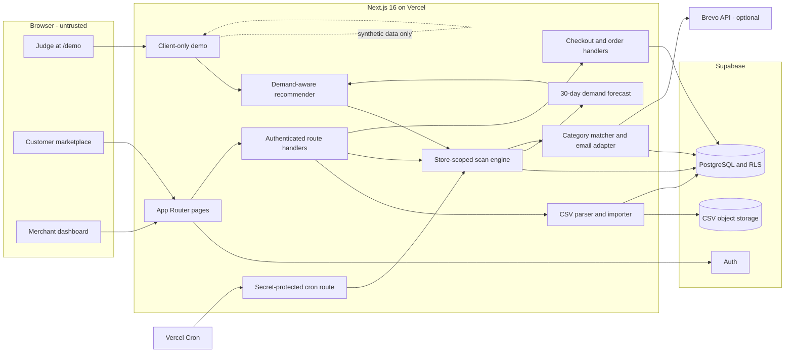
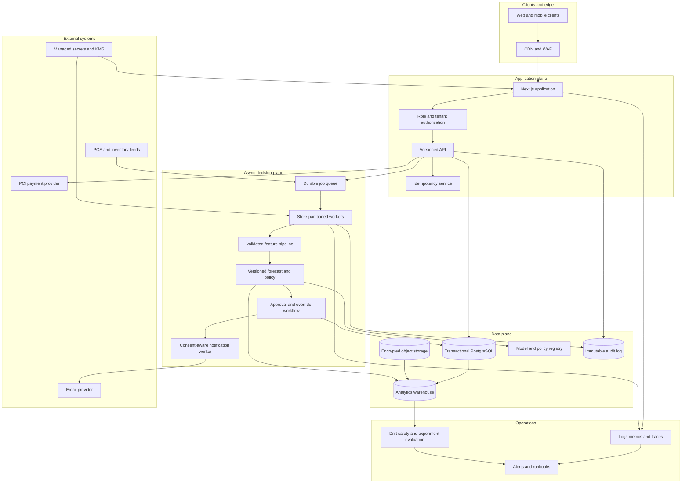

# FreshSaver Architecture

## Scope

FreshSaver has two related execution paths:

- The connected MVP is a Next.js marketplace and merchant application backed by
  Supabase, with optional Brevo email and Vercel cron automation.
- `/demo` is a credential-free client page. It uses embedded synthetic records and
  the real recommender but does not read or write connected application data.

The first diagram documents the current MVP. The second is a production target,
not a claim about current implementation.

## MVP Architecture

## Current Component Responsibilities

| Component | Responsibility |
|---|---|
| Next.js pages | Public marketplace, authentication views, customer account, merchant and super-admin dashboards |
| Route handlers | Authenticate, authorize, validate input, and mediate service-role database work |
| Supabase Auth | Cookie-backed customer, store-admin, and super-admin sessions |
| PostgreSQL and RLS | Products, stores, assignments, customers, scans, email logs, orders, items, and audit evidence |
| Supabase Storage | Best-effort archive of uploaded CSV source files |
| CSV importer | Validate at most 10,000 rows and 5 MB; upsert by store and SKU; record row errors |
| Scan engine | Read active store inventory and recent accepted/completed orders; persist recommendations and scan summaries |
| Demand forecast | Produce store-history velocity or a labeled sparse-history fallback |
| Markdown recommender | Evaluate tier-specific price candidates and enforce expiry and manager-override rules |
| Brevo adapter | Send category-matched email when configured and log sent or failed attempts |
| Order handlers | Re-read price, stock, active state, and expiry state; create order and items; decrement stock |
| `/demo` | Run the recommender against embedded synthetic data and local interaction state |

## Main MVP Data Flows

### Inventory To Recommendation

1. An authenticated store admin uploads a CSV to `/api/products/import`.
2. The server requires columns `product_name`, `sku`, `price`, `mrp`, `expiry_date`,
   and `category`; image and stock are optional.
3. Valid rows are tagged with the admin's `store_id` and upserted on
   `(store_id, sku)`. Invalid rows retain row-level reasons.
4. A best-effort copy is written to the `csv-uploads` bucket and an upload log is
   written with the store ID.
5. A store admin starts a scan for only that store, or the secret cron/super admin
   starts a platform scan.
6. The scan reads 30 days of accepted/completed order items and builds forecasts.
7. The XGBoost service predicts candidate sell-through when configured; the labeled
   deterministic forecast remains the availability fallback.
8. The optimizer returns a hold, pending markdown, blocked, or manual-override action.
9. Gemini generates a grounded summary and campaign from fixed evidence.
10. Product evidence and pending recommendations are persisted without publishing a markdown.

### Recommendation To Customer

1. A store owner approves a pending Tier 1 or Tier 2 recommendation.
2. Only subscribed customers are considered.
3. Empty preference lists receive all categories; otherwise matching is
   case-insensitive against the product category.
4. The approved price is published and Brevo is called only when `BREVO_API_KEY` exists.
5. `email_logs` records success or failure and prevents the same customer, SKU, and
   tier from being sent again.
6. The public marketplace exposes active, non-expired product data and store data.

### Cart To Order

1. The client cart is constrained to one store.
2. Checkout requires an authenticated customer and displays a mock payment form.
3. Card fields remain client-side and are not sent to the order API.
4. The order API ignores client prices and re-reads product price, stock, activity,
   and expiry state for the requested store.
5. It creates an order and item rows, then invokes the service-role stock decrement
   helper for each item.
6. Customers see their order history; the assigned store admin controls allowed
   order status transitions.

Current limitation: order creation, item insertion, and all stock decrements are not
one database transaction. The current decrement loop is best effort. Production
must replace this with atomic reservation and idempotent order creation.

## Audit Schema From Migration 006

Migration `006_demand_aware_markdowns.sql` adds:

- Product recommendation price, discount, reason JSON, confidence, version, and time.
- Product-level scan recommendation evidence.
- `store_id` on scan, email, and CSV audit logs with indexes.
- `append_price_history` and conditional `decrement_stock` service-role functions.
- Store-admin read policies for their scan, email, and upload logs.

The scan evidence stores model mode, sample count, history days, validation MAE,
inputs, all candidate prices, reason codes, and explanation. This supports review;
it does not by itself prove model quality or business impact.

## Production Target Architecture

## Production Changes Required

- Move scans and email sends to durable, idempotent, store-partitioned jobs.
- Use database transactions for order creation, inventory reservation, payment
  state, and compensation.
- Replace mock payment with a hosted PCI-compliant provider; never handle raw card
  details in application code.
- Centralize tenant and role authorization; remove identity decisions based only on
  a hard-coded email.
- Eliminate broad service-role queries where a user-scoped client or constrained
  database function can perform the operation.
- Add immutable audit retention, consent history, unsubscribe enforcement, and
  notification frequency controls.
- Add schema validation, malware scanning, retention rules, and tenant prefixes for
  uploaded files.
- Introduce representative offline evaluation, model registry, controlled rollout,
  drift monitoring, rollback, and human approval thresholds.
- Add rate limits, CSRF review, content escaping, CSP, dependency scanning, backup
  restore tests, and incident runbooks.
- Define SLOs and measure them; do not inherit unverified targets from product
  requirement documents as achieved results.
